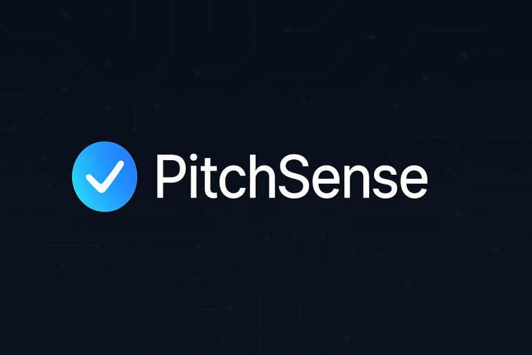

<p align="center">
  <a href="#contributors-">
    
  </a>
  <a href="LICENSE">
    
  </a>
  <a href="#">
    
  </a>
  <a href="#">
    
  </a>
  <a href="https://devpost.com/software/pitchsen">
    
  </a>
</p>


# 🚀 PitchSense: Your AI Co-Pilot for Fundraising Success

<p align="center">
  
</p>

**Streamline investor discovery, pitch generation, and outreach with AI-powered precision.**

> **TL;DR:** Instantly match with ideal investors, craft compelling pitches and emails, and track your outreach—all in one place.

---

## 🏆 Awards
- 🥇 **Most Impactful Award** – AgentHacks 2025  
  Selected from 180+ submissions at [AgentHacks 2025](https://www.agenthacks.org), hosted by [Dex](https://meetdex.ai/), [AfterQuery](https://www.afterquery.com/), and [AGI House](https://www.agihouse.org). This award recognized PitchSense for its real-world relevance, agentic architecture, and polished execution under 48 hours.

---

## 📋 Table of Contents
1. [Executive Summary](#executive-summary)
2. [The Challenge](#the-challenge)
3. [How It Works](#how-it-works)
4. [Innovation Highlights](#innovation-highlights)
5. [Live Demo & Visuals](#live-demo--visuals)
6. [Continuous Development Roadmap](#continuous-development-roadmap)
7. [Installation & Quick Start](#installation--quick-start)
8. [Built With](#built-with)
9. [Project Structure](#project-structure)
10. [Contributors](#contributors)
11. [License & Acknowledgments](#license--acknowledgments)

---

## 🧠 Executive Summary

PitchSense addresses the inefficiencies of traditional fundraising. By leveraging AI, it accelerates investor matching, generates tailored outreach materials, and manages communication pipelines end-to-end. The result: faster outreach, higher relevance, and better outcomes for founders.

PitchSense was originally developed at [AgentHacks 2025](https://www.agenthacks.org), a leading hackathon focused on responsible, agentic AI systems. The event was hosted by [Dex](https://meetdex.ai/) and [AfterQuery](https://www.afterquery.com/)—both **Y Combinator-backed startups**—alongside [AGI House](https://www.agihouse.org), bringing together over 500 attendees to tackle real-world problems with intelligent agents. PitchSense was awarded **Most Impactful Project** for its practical relevance, clean UX, and strong technical execution.

[View Devpost Submission](https://devpost.com/software/pitchsen)

---

## 🚩 The Challenge
Traditional fundraising involves manual investor discovery, generic pitches, and fragmented outreach tracking. This inefficiency wastes valuable founder time and resources, reducing their focus on core business growth.

---

## 🔄 How It Works
1. **Investor Matching Engine**
   - Captures founder details (sector, stage, traction)
   - Uses semantic search with OpenAI Embeddings and FAISS
   - Provides ranked investor recommendations

2. **Dynamic Pitch Generator**
   - Customizes pitch decks and emails using GPT-4
   - Provides confidence tags for human oversight

3. **Outreach Management**
   - CRM-lite tracking system (Airtable/Notion integration)
   - Status indicators: Contacted, Replied, Intro Requested

---

## 💡 Innovation Highlights
- **Smart Matchmaking:** Highly relevant, personalized investor recommendations  
- **AI-enhanced Communication:** Human-like tone, avoiding robotic phrasing  
- **Integrated Outreach Tracking:** Real-time CRM synchronization for transparency  
- **Human-AI Collaborative Interface (HCI):** Seamlessly integrates human judgment with AI suggestions, enhancing decision-making and trust.  

---

## 🚀 Live Demo & Visuals

<p align="center">
  <a href="https://www.loom.com/share/551b3a4a03794d24b097952f0ec0f8b4?sid=b0f19d5a-650f-416b-813b-a6fa667ee125" target="_blank">
    
  </a>
</p>

<p align="center">
  <a href="https://www.loom.com/share/551b3a4a03794d24b097952f0ec0f8b4?sid=b0f19d5a-650f-416b-813b-a6fa667ee125" target="_blank">
    
  </a>
</p>


---

## 🌟 Continuous Development Roadmap

PitchSense is more than a tool—it's your AI fundraising agent, continuously evolving through advanced AI and human-AI collaboration:

- **Phase 1: Intelligent Automation (Current)**  
  - Robust investor matching and pitch generation  
  - Initial CRM integration for seamless outreach management  

- **Phase 2: Enhanced Human-AI Collaboration (Next)**  
  - Interactive feedback loops to refine AI predictions  
  - Real-time human-in-the-loop interventions for critical decisions  
  - Enhanced UI/UX design for intuitive human-AI interaction  

- **Phase 3: Fully Autonomous Agentic System (Future)**  
  - Autonomous management of investor communications  
  - Predictive analytics to forecast fundraising success  
  - Integration with broader fundraising ecosystems  

PitchSense aims to empower founders by turning AI into a trusted co-pilot, blending efficiency and human insight seamlessly.

---

## ⚙️ Installation & Quick Start
```bash
# Clone repository
git clone https://github.com/Avikalp-Karrahe/pitchsense.git
cd pitchsense

# Setup frontend
cd Front-end\ pitchsense
npm install
npm run dev

# Setup backend
cd ../server
python -m venv venv
source venv/bin/activate
pip install -r requirements.txt
uvicorn server.main:app --reload
```

Open <http://localhost:8501> to interact.

---

## 🛠️ Built With
- **Frontend:** Next.js, Tailwind CSS  
- **Backend:** FastAPI, Python, GPT-4, Anthropic Claude  
- **Database:** CSV, FAISS embeddings  
- **Infrastructure:** Vercel, AWS Lambda  

---

## 🗂️ Project Structure
```
├── Front-end pitchsense/         # Next.js frontend application
│   ├── public/                   # Static assets
│   ├── src/                      # Source code
│   ├── match_api.py              # Matching helper used by frontend
│   ├── eslint.config.mjs         # ESLint configuration
│   ├── next.config.ts            # Next.js configuration
│   ├── postcss.config.mjs        # PostCSS configuration
│   ├── tailwind.config.ts        # Tailwind CSS configuration
│   ├── tsconfig.json             # TypeScript configuration
│   └── README.md                 # Frontend-specific README
├── server/                       # FastAPI backend
│   ├── llm/                      # LLM integration modules (OpenAI, Anthropic)
│   ├── routes/                   # API routes (investor-match, pitch-gen, etc.)
│   ├── main.py                   # Backend entrypoint
│   └── __pycache__/              # Compiled Python cache
├── data files/                   # CSV datasets for analysis
│   ├── VC_FundStage_Location_Sector.csv
│   ├── Startup Insights (2012–2021).csv
│   └── vc22.csv
├── Python scripts/               # Standalone utility logic
│   ├── agent_runner.py
│   ├── matching.py
│   ├── pitch&email.py
│   ├── confidence_scorer.py
│   ├── generator.py
│   ├── clarifier.py
│   ├── improver.py
│   └── llm_router.py
├── requirements.txt              # Backend dependencies
├── .env                          # Environment variables (not committed)
└── README.md                     # This documentation
```

---

## 👥 Contributors

| Name             | Role      | LinkedIn                                                | GitHub                                       |
|------------------|-----------|---------------------------------------------------------|----------------------------------------------|
| Rachel Guo       | Frontend Lead | [LinkedIn](https://www.linkedin.com/in/rachel-guo0429/) | [GitHub](https://github.com/rachelqingguo)   |
| Chaitanya Khot   | UI/UX Lead | [LinkedIn](https://www.linkedin.com/in/chaitanyakhot/)  | [GitHub](https://github.com/ckkhot)          |
| Yifei (Lexie) Li | Backend Lead  | [LinkedIn](https://www.linkedin.com/in/yifeilexie/)     | [GitHub](https://github.com/Yifei-Lexie-Li)  |
| Avikalp Karrahe  | AI Systems Lead   | [LinkedIn](https://www.linkedin.com/in/avikalp/)        | [GitHub](https://github.com/Avikalp-Karrahe) |

---

## 📜 License & Acknowledgments
Distributed under the [MIT License](LICENSE).

Special thanks to the organizers of [AgentHacks 2025](https://www.agenthacks.org)—including [Dex](https://meetdex.ai/), [AfterQuery](https://www.afterquery.com/), and [AGI House](https://www.agihouse.org)—for fostering a space where ambitious agentic ideas like PitchSense could be built and celebrated.

<div align="center">
⭐️ If you found PitchSense valuable, please star our <a href="https://devpost.com/software/pitchsen">Devpost Submission</a> and share it with your network! ⭐️<br/>
You made it all the way here! Thank you for your time and support 🙌
</div>

